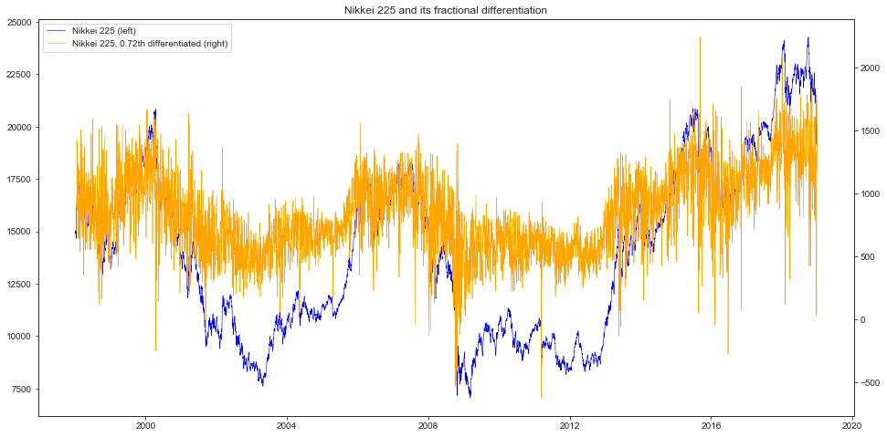

# Fracdiff

[](https://pypi.org/project/fracdiff/)
[](https://travis-ci.com/simaki/fracdiff)
[](https://codecov.io/gh/simaki/fracdiff)
[](https://pypi.org/project/fracdiff/)
[](LICENSE)

Fractional differentiation of time-series.


## Installation

```sh
$ pip install fracdiff
```

## Features

- Perform fractional differentiation of time-series
- Scikit-learn-like API

## What is fractional differentiation?

See [M. L. Prado, "Advances in Financial Machine Learning"][prado].

## How to use

[](https://colab.research.google.com/github/simaki/fracdiff/blob/master/sample/howto/howto.ipynb)

### Fractional differentiation

A transformer class `Fracdiff` performs fractional differentiation by its method `transform`.
The following example gives 0.5th differentiation of S&P 500.

```python
from fracdiff import Fracdiff

spx = ...  # Fetch 1d array of S&P 500 historical price

fracdiff = Fracdiff(0.5)
spx_diff = fracdiff.transform(spx)
```

The result looks like this:


### Differentiation while preserving memory

A transformer class `StationaryFracdiff` finds the minumum order of fractional differentiation that makes time-series stationary.

```python
from fracdiff import StationaryFracdiff

nky = ...  # Fetch 1d array of Nikkei 225 historical price

statfracdiff = StationaryFracdiff()
statfracdiff.fit(nky)

statfracdiff.order_
# 0.23
```

Differentiated time-series with this order is obtained by subsequently applying `transform` method.
This series is interpreted as a stationary time-series keeping the maximum memory of the original time-series.

```python
nky_diff = statfracdiff.transform(nky)  # same with Fracdiff(0.23).transform(nky)
```

The method `fit_transform` carries out `fit` and `transform` at once.

```python
nky_diff = statfracdiff.fit_transform(nky)
```

The result looks like this:



Other examples are provided [here](sample/examples/examples.ipynb).

Example solutions of exercises in Section 5 of "Advances in Financial Machine Learning" are provided [here](sample/exercise/exercise.ipynb).

## References

- [Marcos Lopez de Prado, "Advances in Financial Machine Learning", Wiley, (2018).][prado]

[prado]: https://www.wiley.com/en-us/Advances+in+Financial+Machine+Learning-p-9781119482086
